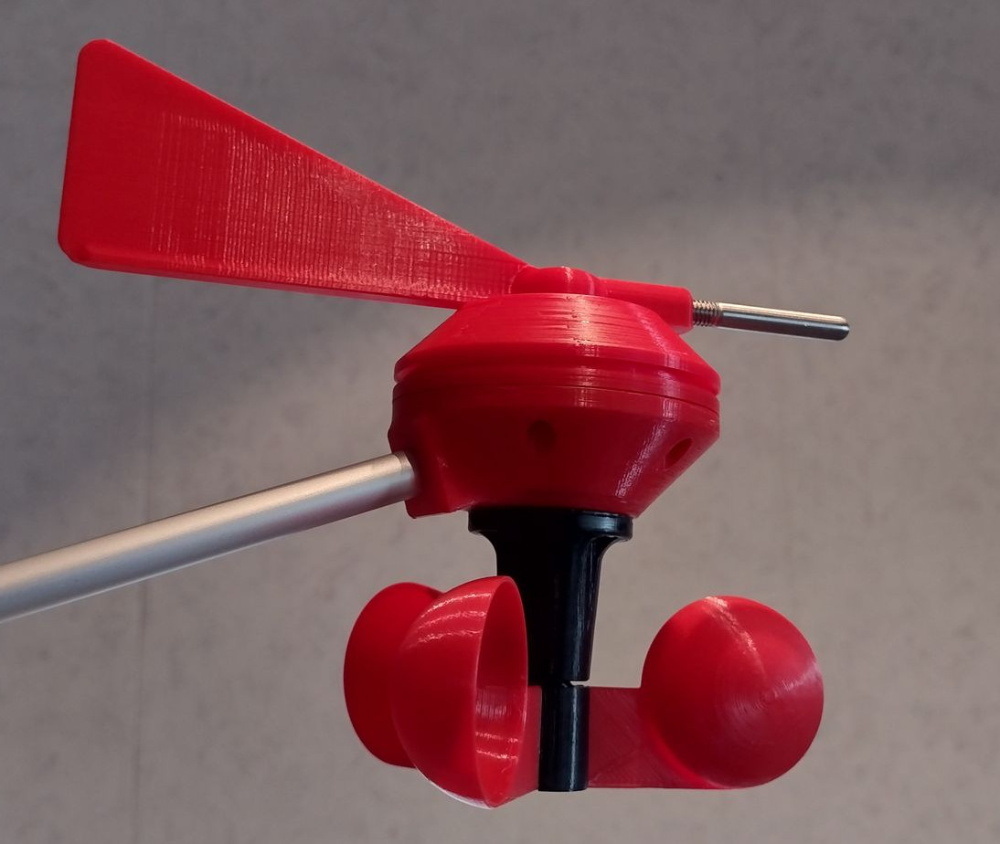
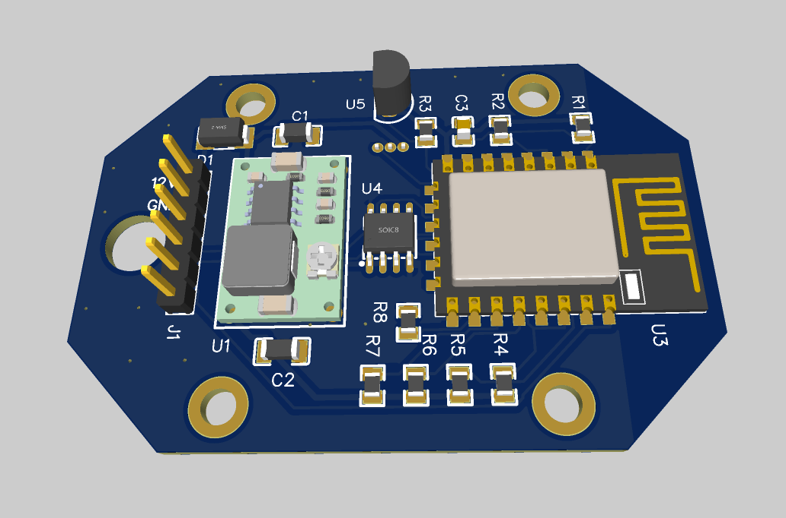
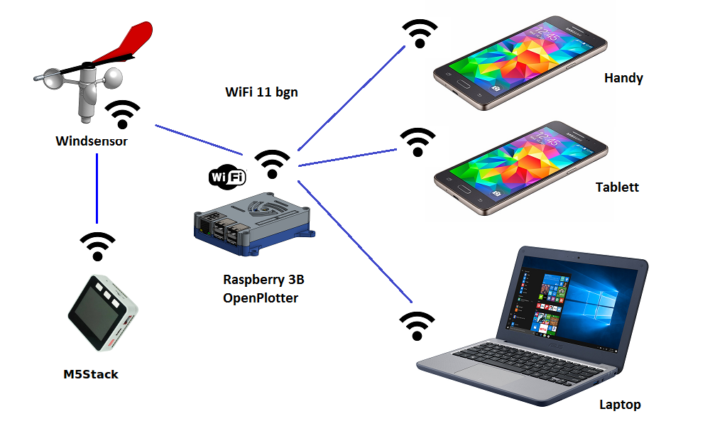
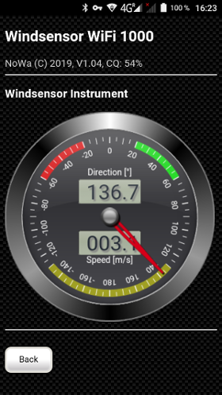
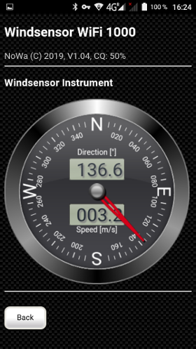

## Windsensor Yachta

Nou link
[Afegeixo més info](https://open-boat-projects.org/en/zusammenbauanleitung-windsensor-yachta/)

Image: Wind Sensor Yachta
 
The initial idea for the Yachta wind sensor is based on a work by the user Yachta. He presented and published the wind sensor on [Thingiverse](https://www.thingiverse.com/thing:2261719). Udo took up the idea of ​​Yachta and modified the mechanics a little. The arms of the cup wheel have been separated. This makes 3D printing easier to implement. The electronics were completely redesigned by him. The microcontroller was removed and replaced with an ESP8266. A DC/DC converter module was installed so that the wind sensor can also be operated at 12V. The circuit board was created with the Windows software Sprint Layout and converted into Gerber files. Now is a new BCP available from Norbert.

Image: PCB board

The PCB project is listed on [Open Source Hardware Lab](https://oshwlab.com/) an can be edited with the webbased online [layout program EasyEDA](https://easyeda.com/norbert-walter/projects).

The board without components can be ordered from [Aisler](https://aisler.net/p/VTNPJWKQ) or direct in EasyEDA.

There are different firmware for the wind sensor. Both Udo and Julian ([Jukolein](https://github.com/jukolein/NMEA0183-Windsensor)) have created their own firmware versions with different functionality. Udo has also designed another wind sensor, which is a further development of the Yachta wind sensor. The functional principle and the electronics are identical. But you need a different board because the wind sensor is slimmer. Julian published the whole thing on [Github](https://github.com/jukolein/NMEA0183-Windsensor) and wrote his own firmware for the wind sensor, which can also be used for this wind sensor. 

The WiFi 1000 firmware is a firmware that can be used universally for various wind sensors and was originally developed by Norbert for the [WiFi 1000 wind sensor](https://gitlab.com/norbertwalter67/Windsensor_WiFi_1000). The current versions of the firmware can be found in the respective own repositories at Github and GitLab.

A lively exchange of experiences takes place in the German-speaking [sailing forum](https://www.segeln-forum.de/board194-boot-technik/board195-open-boat-projects-org/79131-windsensor-ii-iii/). You can also participate in English.

If you like to help or consider this project useful, please donate. Thanks for your support!

## Technical characteristics

* Measuring wind speed and wind direction
* Robust mechanics
* Without special metal parts
* All parts can be found in the hardware store
* Easy 3D parts
* Weight app. 210g
* Weatherproof and UV stable
* No cabling for sensor signals
* Digital signal transmission with WiFi only
* 12V power supply utilizing top light power cable
* Using a ESP8266 for WiFi and data handling
* Update rate 1 samples per second
* No onboard instrument required
* Visualisation in OpenPlotter via laptop, mobile fone or tablett
* Web interface for operation
* No extra software required (display is the browser)
* Supporting  NMEA 0183 protocol
* Firmware update via Internet

## Create your own code

You have the option of creating your own code using the online [software development environment Gitpod](https://gitpod.io/#https://github.com/norbert-walter/Windsensor_Yachta). Follow this link and a finished development environment similar to PlatformIO will be created that runs in your browser with all code components. To compile the software, enter ***bash run*** in the terminal. In the workspace you will find the compiled binary code under ***.pio/build/d1_mini/firmware.bin***. With a right click you can download the binary file.

## Device flash process

With the [Web Flash Tool](https://norbert-walter.github.io/Windsensor_Yachta/flash_tool/esp_flash_tool.html) you can very easily flash the device with the firmware from the web browser. You need a Chrome or Edge browser and a USB connection cable. If the device is connected to the USB port of the computer, the serial connection can be selected and the flash process can then be started.

## Firmware characteristics

**Wind Sensor Yachta Firmware**
* Web configuration and graphical visualisation
* Webserver port 80
* TCP port 6666
* TCP NMEA0183 telegram MWV, VWR, VPW, INF
* JSON http://192.168.4.1/json
* Firmware update via Internet
* Android App

## How can I use it?

I use the windsensor in combination with [OpenPlotter](http://www.sailoog.com/openplotter) on a Raspberry Pi 3B. OpenPlotter serves as access point for WiFi devices. The windsensor connects to OpenPlotter via WiFi and transmits the NMEA0183 data telegrams every second. The windsensor sends NMEA0183 telegrams. Check here [link](http://www.nmea.de/nmea0183datensaetze.html) for more information. 

Img: Connection options

Now also available as Android App. It is is a WebApp connecting directly to the windsensor to display all data.

Img: Android App for Wifi 1000 firmware

## What is the current status?

I have completed many tasks but still not everything is perfect so far.

- [x] Technical recherche
- [x] Evaluation of function
    - [x] Hall sensors and rotation sensor
    - [x] Magnets
    - [x] Prototype circuit
    - [x] Test software
    - [x] Web display technologies
    - [x] 3D material test
    - [x] Coating tests
- [x] Mechanical design
    - [x] 3D parts
- [ ] Electronic design
    - [x] Circuit design
    - [x] Board design
    - [ ] Customer sample circuit
- [ ] Software
    - [x] Basic functionality
    - [x] NMEA0183 WiFi
    - [x] NMEA0183 Serial
    - [x] mDNS Service
    - [x] JSON
    - [ ] MQTT
    - [ ] Wind History Diagram
    - [x] Sensor Data Diagram for diagnostic and mechanical adjustment
    - [x] Web-Updater
    - [x] Web-Configurator
    - [x] Web server as data display
    - [x] Andoid App
    - [x] External Diagnostic Tool
	- [x] Support for other wind sensor types
- [x] Components ordering
    - [x] Electronic board
    - [x] Mechanical parts
    - [x] Fittings
- [x] Prototyp creation
    - [x] Yachta prototype
    - [x] Modifyed Yachta prototype
- [ ] Production Zero series
    - [ ] DIY Kits
    - [ ] Assembled windsensor
- [ ] Shipping Zero Series
- [ ] Documentation
    - [ ] Technical description
	- [x] Description Web frontend
    - [ ] Construction manual
    - [x] Part list
    - [ ] User manual
    - [ ] Data sheet
- [ ] Application tests
    - [x] Temperature 20...80°C
    - [ ] Vibration test by strong wind (8bft)
    - [x] WiFi stability test
    - [x] Connection test
    - [ ] Rain test
    - [ ] IPX6 Water resistance test
    - [ ] UV radiation test
    - [ ] Long time test
    - [ ] Test with auto pilot
    - [x] User experiences
- [ ] Extensions
    - [x] Multi function display with M5Stack
    - [ ] NMEA2000 Gateway
    - [ ] Weather data sensor with BME280
- [ ] Certification
    - [ ] CE Certification

## Questions?

For questions or suggestions please get in contact via email at norbert-walter(at)web.de.
